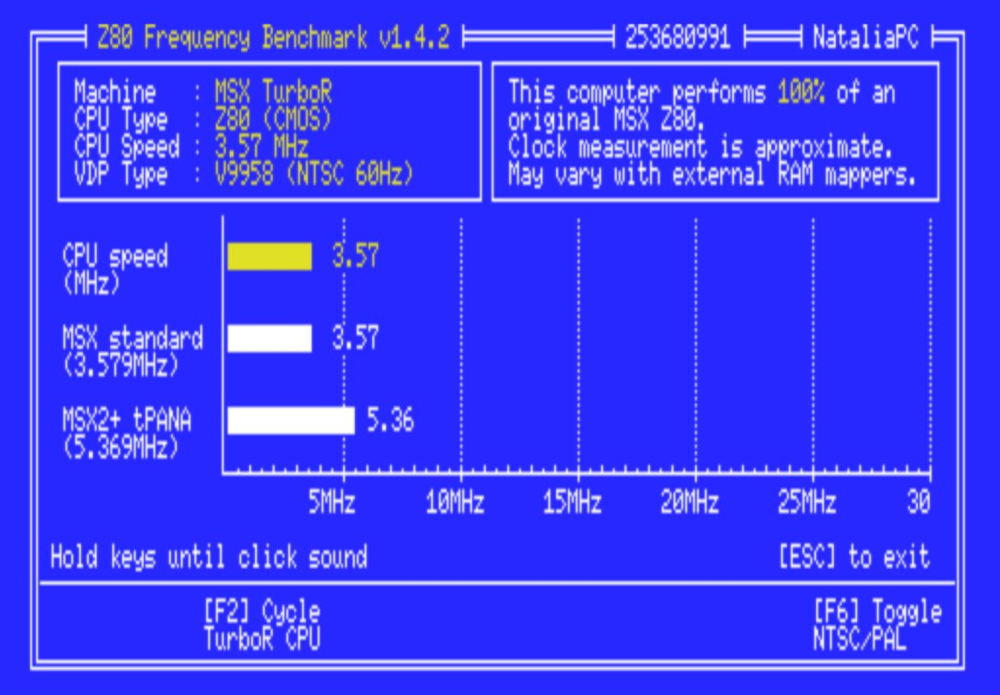

# MSX Z80 Frequency Benchmark

[[**Downloads page**](https://github.com/nataliapc/msx_z80bench/releases)]

**Z80BENCH** program allows you to measure and manage your MSX CPU speed.

It has been created with not only _Panasonic MSX_ with _TurboPana_ and _MSX TurboR_ machines in mind, but also _FPGA_ machines [_OCM/MSX++_](https://github.com/gnogni/ocm-pld-dev), and MSX based on boards and hardware developments like [_Tides-Rider_](https://genami.shop/blogs/news/requirements-to-assemble-a-tides-rider) and [_Taka-Nami_](https://genami.shop/blogs/news/knowing-the-taka-nami) that allow different CPU speeds.

The measurement is approximate and is based on the number of _VDP_ interrupts that occur during a test loop in `IM2` mode.

This means that for low clock frequencies the precision is higher and as the speed increases the margin of error also increases.

With longer test loops and longer duration, the margin of error would be reduced, but a compromise between precision and usability has been chosen.

The available options vary depending on which _MSX_ machine you run the program on.

The visual presentation and operation is based on similar programs that were developed for old _PCs_ under _MS-DOS_.

## Displayed Information

- **Machine:** MSX generation obtained from _BIOS ROM_ and manufacturer if available obtained from [_expanded I/O ports_](https://map.grauw.nl/resources/msx_io_ports.php#expanded_io).
- **CPU Type:** detection is performed by checking how specific opcodes behave for each CPU. `Z80`, `R800`, and `Z280` are detected.
- **CPU Speed:** speed calculated by the test loop.
- **VDP Type:** video chip detection (_TMS9918, V9938, V9958_). Output frequency is also shown (_NTSC/PAL_).

## Options

The options are only shown if they are detected as possible.

The keys must be held down until you hear a click sound, which is when each of the tests ends.

- **F1:** Toggle _TurboPana_ CPU speed (_3.58MHz, and 5.37MHz_)
- **F2:** Cycle _TurboR_ CPU (_Z80, R800(ROM), and R800(DRAM)_)
- **F3:** Cycle _OCM_ Speed (_3.58MHz, 5.37MHz, 4.10MHz, 4.48MHz, 4.90MHz, 5.39MHz, 6.10MHz, 9.96MHz, and 8.06MHz_)
- **F6:** Toggle _NTSC/PAL_. CPU Speed may vary when changing this value due to the different duration of their interrupts (_60/50Hz_ respectively).

## Final Considerations

Clock measurement is approximate, and may vary when using external RAM mappers.

The number that appears in the upper right corner indicates the number of interrupts that occurred during each iteration of the test loop.

## Acknowledgments

Thank you very much to everyone who has been testing the program so that it could become a reality.

### I hope you all find this useful! :D
NataliaPC